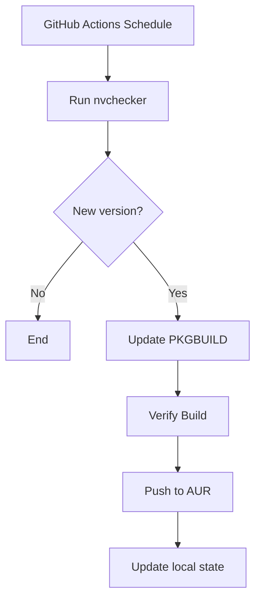

# Paseo Auto-Updater

This repository contains the AUR package `paseo-desktop-bin` and automated tooling to keep it updated with the latest releases from the upstream project.

## Description

Paseo is a desktop application that provides one interface for all your Claude Code, Codex and OpenCode agents. This auto-updater ensures the AUR package stays current with upstream releases.

## Features

- Automated version checking using [nvchecker](https://github.com/lilydjwg/nvchecker)
- Scheduled updates every 4 hours via GitHub Actions
- Automatic PKGBUILD updates
- Build verification
- Seamless publishing to AUR

## How It Works

The automation workflow monitors the upstream GitHub repository for new releases and automatically updates the AUR package:



1. **Version Check**: Uses nvchecker to check for new releases on the [Paseo GitHub repository](https://github.com/getpaseo/paseo)
2. **Update PKGBUILD**: Automatically updates the version number and checksums in PKGBUILD
3. **Build Verification**: Tests the package build in a clean Arch Linux environment
4. **Publish**: Commits and pushes the updated package to the AUR
5. **State Update**: Updates local tracking files for future comparisons

## Installation

Users can install the package from AUR using their preferred AUR helper:

```bash
yay -S paseo-desktop-bin
# or
paru -S paseo-desktop-bin
```

## For Maintainers

This repository is configured for automated updates. To set up similar automation for another package:

1. Configure `nvchecker.toml` with your upstream source
2. Set up GitHub Actions secrets with AUR SSH access
3. Adjust the workflow schedule and build steps as needed

### Manual Update

To manually trigger an update:

1. Run `nvchecker -c nvchecker.toml`
2. If updates are found, update PKGBUILD version
3. Run `updpkgsums` to update checksums
4. Test build with `makepkg`
5. Commit and push changes

## Contributing

Contributions are welcome! Please feel free to open issues or submit pull requests.

## License

This project follows the same license as the upstream Paseo project: AGPL-3.0-only.
